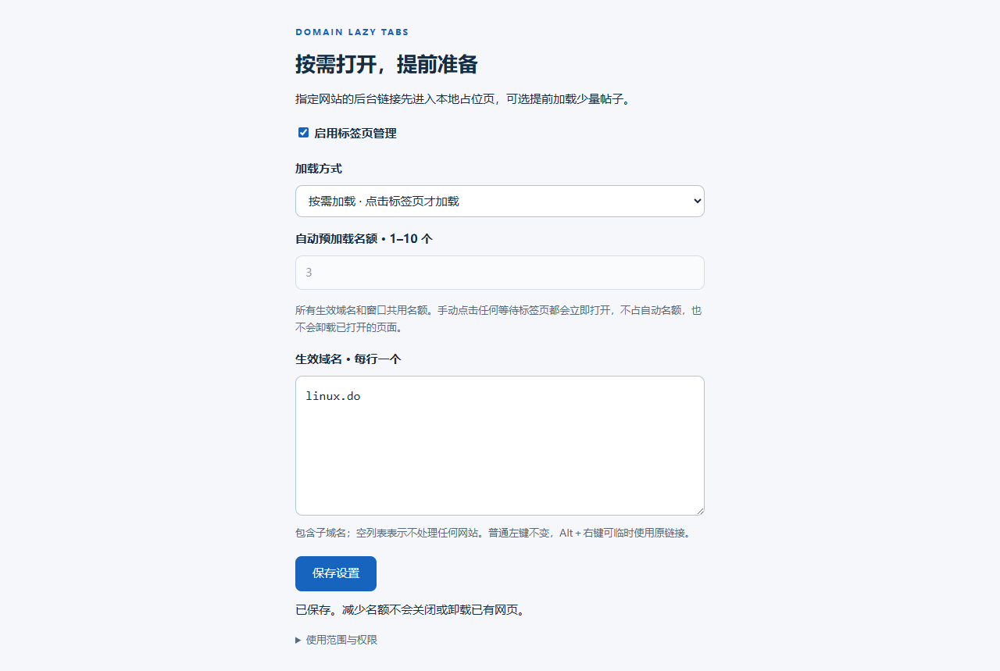

# Domain Lazy Tabs


按域名延迟打开 Chrome 后台标签页，也可选择提前加载少量帖子。默认匹配 `linux.do` 及其子域名，也可以添加自己的域名。

[下载发布版本](https://github.com/candyfake/domain-lazy-tabs/releases) · [提交问题](https://github.com/candyfake/domain-lazy-tabs/issues) · [验证记录](docs/TESTING.md)



在网页中右键符合规则的链接，选择浏览器原生的「在新标签页中打开链接」时，新标签页先打开扩展自带的本地占位页。默认使用「按需加载」：切换到该标签页后，才导航到目标网页。也可以在设置中开启「提前加载」，由扩展按顺序放行少量后台标签。普通左键访问保持原样。

**没有「先加载一秒再休眠」的等待过程。**本扩展在受支持的链接打开操作发生前替换目标地址。按需模式下，查看前不发起目标网页导航；提前加载模式下，只有取得自动名额或被手动点击的标签才导航，其余继续等待。它不拦截来源网页自身的预取、已有请求或其他扩展的网络行为，也不承诺零内存占用。

> English: A Manifest V3 extension that parks matching links locally until activation, with an optional background preload queue (3 automatic slots by default). Manual activation always opens immediately without replacing the automatic tabs. Designed for Chrome's native “Open link in new tab”, with configurable target domains and no server or analytics.

## 功能

- 域名白名单，默认 `linux.do`，包括其子域名。
- 点击扩展图标，编辑域名列表或切换总开关。
- 两种模式：按需加载；提前加载指定数量的后台帖子（默认 3 个，可设 1～10 个）。
- 自动预加载的帖子关闭后，按创建顺序补上下一个；手动点击任何等待标签始终优先打开。
- 等待标签保留链接标题，不添加「待查看」前缀，使用扩展图标标识尚未加载的状态。
- 支持原生右键菜单打开、Ctrl/Cmd + 左键以及鼠标中键打开链接。
- 从任意受支持的普通网页打开匹配域名的链接都可生效，按**目标域名**判断。
- 按住 Alt 再右键，临时保留原始链接和原生菜单行为。
- 本地保存配置；无账号、服务器、遥测、广告或远程执行代码。

## 本地安装

需要 Chrome 102 或更新的桌面版本。组织管理的浏览器可能不允许加载本地扩展。

1. 下载项目源码 ZIP，或下载 Releases 中的扩展 ZIP（如果已有发布版本）。
2. 解压到固定目录；使用期间不要移动或删除该目录。
3. 在 Chrome 地址栏输入 `chrome://extensions`，打开右上角「开发者模式」。
4. 点击「加载已解压的扩展程序」。下载源码时选择项目里的 **`extension` 文件夹**；下载发布包时选择解压后直接包含 **`manifest.json`** 的文件夹。
5. 停用 Enhanced Lazy Tabs Loader 等同类自动休眠扩展，避免叠加行为。
6. **刷新已经打开的来源网页**，使本扩展的链接处理脚本生效。

无需 Node.js、编译或命令行。不要把 ZIP 直接拖进浏览器当作商店扩展安装。

## 使用示例

1. 保持 `linux.do` 主页在前台。
2. 右键某个帖子链接，选择「在新标签页中打开链接」。
3. 继续浏览主页。新标签页保留为本地等待页面，尚未导航到帖子。
4. 点击新标签页，开始加载帖子。

在扩展设置中填写域名，每行一个，例如：

```text
linux.do
example.com
```

域名匹配包含子域名：`linux.do` 可匹配 `linux.do`、`www.linux.do`，不会匹配 `notlinux.do` 或 `linux.do.example.com`。列表填写域名即可，不需要填写帖子路径。

## 提前加载模式

在设置中选择提前加载并将数量设为 3：

1. 在 Linux.do 主页连续打开 10 个帖子，前 3 个自动加载，其余保留本地等待页。来源主页不占名额。
2. 关闭这 3 个自动加载帖子中的任意一个，队列中的第 4 个补上；浏览一个自动加载帖子不会释放名额，关闭才释放。
3. 直接点击第 8 个等待标签，第 8 个立即加载，前 3 个不受影响。手动打开不占自动名额，关闭它也不会额外放行队列。
4. 只打开 1～2 个帖子时，它们都可以自动加载。所有设置中的域名、所有窗口共用自动名额。

**3 是自动预加载名额，不是所有已加载标签的总上限。**手动打开的页面可以让总数超过 3；扩展不会强制休眠、关闭或重新加载你正在使用的网页。自动加载帖子离开最初匹配的域名及其子域名范围后会释放名额，在该范围内跳转仍保留名额。降低数量不会卸载已打开页面，需要等现有名额释放后再按新上限补充。

队列由浏览器标签事件驱动，不进行定时轮询。内存开销主要来自提前打开的真实网页：通常比一次打开全部 10 个帖子少，但会比完全按需加载多。页面中的图片、脚本、视频和实时连接会影响实际占用。

队列保存在当前浏览器会话中，后台处理程序休眠后仍可恢复；浏览器重启或扩展更新、重新加载会清空会话队列。此前已打开的真实网页不会被重新纳入计数，残留等待页重新登记时也无法保证沿用重启前的打开顺序，因此本功能不能作为跨浏览器重启的严格内存上限。

## 工作原理与边界

扩展的页面脚本在受支持的链接操作中，将匹配链接临时指向扩展的本地等待页面。原始目标和截断至前 200 个字符的链接文字或标题保存在等待页面 URL 的片段（`#` 后的部分）中，标题用于区分标签页。尚未放行的后台标签只加载这份轻量扩展页面；取得自动预加载名额或被手动查看后，使用原始地址导航。等待页使用来源链接的文字，不能在不请求目标网页的前提下保证取得其完整 HTML 标题。

这与 `chrome.tabs.discard()` 不同：它不需要先打开目标页面再尝试休眠。已经访问过的标签页不会被本扩展再次自动休眠。

| 情况 | 行为或限制 |
| --- | --- |
| 普通网页中的标准 HTTP/HTTPS 链接 | 支持按目标域名处理 |
| 普通左键在当前标签页打开 | 保持原始访问行为 |
| 右键菜单中的「复制链接地址」 | 可能复制到占位页地址；**Alt + 右键**可操作原始地址 |
| 从地址栏、书签、历史记录打开 | 不处理 |
| 网站脚本 `window.open()`、无标准链接的按钮 | 不保证支持 |
| Chrome 内部页面、Chrome 网上应用店等受保护页面 | 无法注入页面脚本，不处理 |
| 无痕窗口 | 当前版本不支持 |
| 安装前已打开的网页 | 需要先刷新 |
| 新标签页自动切到前台 | 会立即加载目标页，因为它已经可见 |
| 页面预取、DNS 预解析、其他既有请求 | 不负责阻止，不能据此保证目标站点零网络活动 |
| 本地等待标签页 | 仍占用少量资源；不是零内存或浏览器原生挂起状态 |

打开方式被网站脚本接管、页面嵌套方式或浏览器行为差异，可能影响兼容性。遇到不符合预期的网站，可先使用 Alt + 右键绕过处理，并提交复现步骤。

保护需要扩展脚本及本地设置已读取完成；页面刚建立且配置尚未就绪，或扩展被重新加载/停用时，不保证拦截。加载已解压扩展后请先刷新来源网页，再使用链接。

## 权限与隐私

扩展使用 `storage` 在本机保存域名列表、开关、模式及当前会话的队列。`tabs` 用于识别本地等待标签、读取标签地址、观察关闭或跨域导航并安排预加载。页面脚本需要在普通 HTTP/HTTPS 来源网页运行，才能从任意网站识别指向白名单域名的链接，因此 Chrome 可能显示较广的网站访问提示。这些能力用于处理链接和本地队列。

不申请 `history` 权限，不向服务器上传网址，不读取账号密码。操作的链接文字或标题用于标识等待标签页，不读取整页正文。目标地址和截断后的链接文字保留在对应等待标签页的本地 URL 中，**本扩展不是隐私浏览或历史记录隐藏工具**。详细说明见 [PRIVACY.md](PRIVACY.md)。

## 手动更新

1. 下载新版，解压并覆盖原安装目录中的扩展文件。
2. 保留同一个安装目录和扩展条目，不要为常规更新先卸载扩展。
3. 打开 `chrome://extensions`，点击本扩展的「重新加载」。
4. 刷新需要继续使用本扩展的来源网页。

1.1.0 增加 `tabs` 权限以管理预加载队列，Chrome 可能要求确认新增的标签信息访问权限。更新后默认保留按需模式；需要预加载时，点击扩展图标，选择「提前加载」，填写 3 并保存。

本地加载的扩展不会通过 GitHub 自动更新。重新加载或更新扩展可能影响尚未打开的等待标签页；更新前建议先处理这些标签页。

## 源码与贡献

扩展运行文件位于 `extension/`，其中 `manifest.json` 是加载入口。提交问题或代码前请参阅 [CONTRIBUTING.md](CONTRIBUTING.md)。版本变化见 [CHANGELOG.md](CHANGELOG.md)，安全问题报告指引见 [SECURITY.md](SECURITY.md)。

### 开发验证

以下命令仅供开发者使用，普通安装不需要 Node.js。在项目根目录运行：

```sh
npm ci
npx playwright install chromium
npm test
npm run test:browser
```

浏览器测试使用独立的 Chromium 测试环境，不使用或修改个人 Chrome 配置目录。测试需要下载 Playwright 的 Chromium。自动测试覆盖范围以测试代码为准；模拟链接操作不等同于完整验证各平台的原生右键菜单行为。

在 Windows 上生成可分发安装包：

```sh
npm run package
```

输出位于 `dist/`，包含扩展 ZIP 与 SHA-256 校验文件。ZIP 根目录直接包含 `manifest.json`。

本项目采用 [MIT License](LICENSE)，由社区独立开发，与 Enhanced Lazy Tabs Loader、Linux.do、Google 均无隶属或合作关系。
